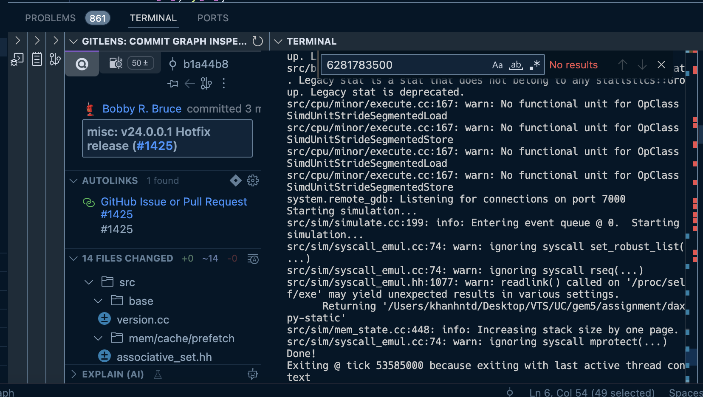

# MSCS531-Thread Level Parallelism (TLP)

## Setup
- **Step 1:** Clone gem5
```
git clone https://github.com/gem5/gem5.git
```
- **Step 2:** Install Gem5's python requirement dependencies with requirements.txt
```
pip install -r requirements.txt
```
- **Step 3:** Install Scons with pip
```
python -m pip install --user scons
```

## Output
When running the following command for simulating the target ISA with the application
```
./build/X86/gem5.opt ./assignment/daxpy.py
```
the result would be:
